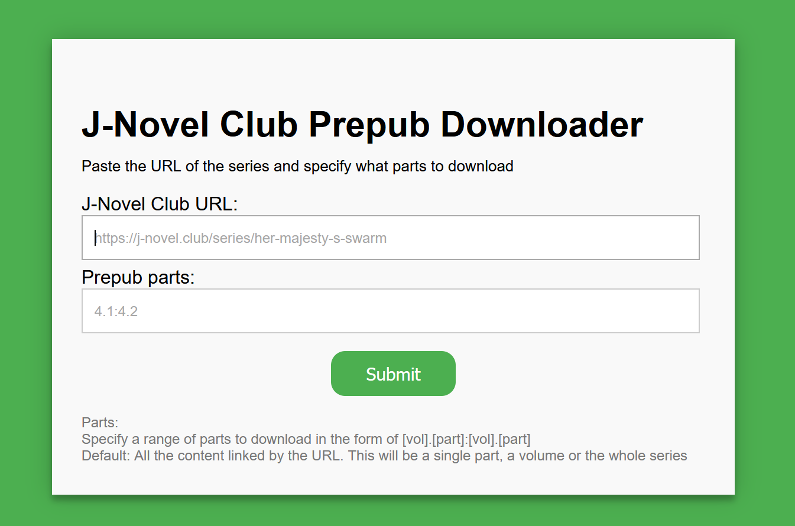

# JNCEP WebUI


Image generated with the use of DALL·E


## About The Project
This is a flask app to generate EPUB files for J-Novel Club pre-pub novels by providing an interface to `jncep`.

I find myself using this when a new prepub drops, as I prefer to read on an e-reader, but I may not able to access a computer immediately after the prepub part comes out.

If this app is running on a server, you can download pre-pubs to your phone then copy them to your e-reader with a USB OTG cable.


## Limitations & Disclaimer
This tool only works with J-Novel Club **novels**, not manga.

`jncep_webui` is completely unaffiliated with J-Novel Club and jncep.
If you have an issue with the tool, please file a bug report on this project, not jncep.


## Getting Started
To get a local copy up and running follow there are two options, docker or native.

### Prerequisites
* J-Novel Club account and membership
* Set the following environment variables:
  
| Name             | Required | Description                                    |
|------------------|----------|------------------------------------------------|
| `JNCEP_EMAIL`    | Yes      | Login email for J-Novel Club account           |
| `JNCEP_PASSWORD` | Yes      | Login password for J-Novel Club account        |
| `JNCEP_OUTPUT`   | No       | Folder to write the output<br>Default: /output |


### Installation
#### Native:
1. Install Python 3 (tested with 3.10)
2. Clone the repo
   ```cmd
   git clone https://github.com/bradleyds2/jncep_webui.git
   ```
3. Install python requirements with `python -m pip install requirements.txt`
4. Installation complete. Run `app.py`.

#### Docker:
1. Install the [bradleyds2/jncep_webui](https://hub.docker.com/repository/docker/bradleyds2/jncep_webui) docker container
   1. A docker-compose.yml has been provided for your convenience.
2. It is strongly recommended (but not required) to mount the container path `/logs`.
   1. Logs will automatically be compressed once they reach 50MB, and will be deleted once they are a week old.
3. Installation completed, start the container


## Usage
### General
This uses jncep to create the epub. If you want to know more about how the part specification works, check out the documentation for it [here](https://github.com/gvellut/jncep#range-of-parts).
#### As an Application
Once started, `jncep_webui` will be available at port 5000.

This page has two fields for input:

| Name             | Required | Description                                                                                                                |
|------------------|----------|----------------------------------------------------------------------------------------------------------------------------|
| J-Novel Club URL | Yes      | The J-Novel Club URL for the series, volume or part                                                                        |
| Prepub parts     | No       | Range of parts to download in the form of <vol>[.part]:<vol>[.part] <br>Default: All content linked to `J-Novel Club URL`] |


Once the `J-Novel Club URL`, and (optionally) the `Prepub parts` field have been filled, click submit to generate your epub.
If the parts go over one volume, each volume will have its own epub, and these will be added to a zip.
Once the epub or zip has been generated, this will be served to the user. The process of generating and sending the epub usually takes a few seconds.

#### As a web API
Following the same rules as `As an application` above, it is possible to use jncep_webui as a web API by sending a GET request to ip-address:5000/epub on the host machine, with the following request headers:

| Name             | Required | Description                                     |
|------------------|----------|-------------------------------------------------|
| `jnovelclub_url` | Yes      | Maps to `J-Novel Club URL` above                |
| `prepub_parts`   | No       | Maps to `Prepub parts                           |
| `JNCEP_EMAIL`    | No       | Overrides `JNCEP_EMAIL` environment variable    |
| `JNCEP_PASSWORD` | No       | Overrides `JNCEP_PASSWORD` environment variable |


Examples:
* With parts specified:
  * http://localhost:5000/epub?jnovelclub_url=https%3A%2F%2Fj-novel.club%2Fseries%2Fwhy-shouldn-t-a-detestable-demon-lord-fall-in-love&prepub_parts=4.1
* Grab all parts
  * http://localhost:5000/epub?jnovelclub_url=https%3A%2F%2Fj-novel.club%2Fseries%2Fwhy-shouldn-t-a-detestable-demon-lord-fall-in-love

Once received, the app will process your request and respond with your epub/zip.


## Special Thanks
This would not have been possible without the hard work of gvellut in creating [jncep](https://github.com/gvellut/jncep), which does all the heavy lifting, thank you!

Thank you to Delgan for [Loguru](https://github.com/Delgan/loguru), it made logging dead-simple